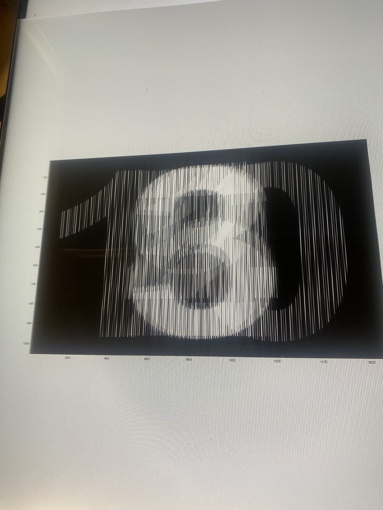
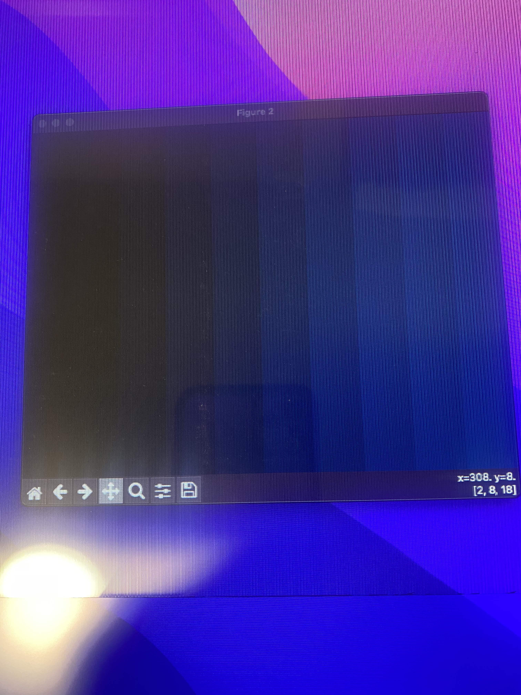

# Glasses-Free-3d-Display
This is a project that turns a regular 1080p monitor into a glasses free 3d display!

This project is a Python implementation of a 3D display system using a lenticular lens sheet, inspired by the "Build Your Own 3D Display" project by [Douglas Lanman](https://www.linkedin.com/in/dlanman/). It was completed as the final project for **CSE 493V**: Virtual & Augmented Reality at the University of Washington.

The system renders a synthetic light field from a set of input views, interlaces them based on lenticular geometry, and outputs an image that produces a 3D effect when viewed through a lenticular sheet mounted on an LCD.

## Overview
- Generate a synthetic light field (from rendered or real-world views)

- Calculate interleaving pattern based on display parameters and lenticular pitch

- Composite the views into a single interlaced image

- Output the result for use with a lenticular sheet overlay

## Tech Stack and Tools
- Python 3

- `NumPy`, `OpenCV`, `Matplotlib` for image manipulation and visualization

- Original reference: MATLAB code by [Douglas Lanman](https://dl.acm.org/doi/10.1145/1837101.1837105)

## About the Conversion
The original project and much of the core research were created by Douglas Lanman, who taught this course. His MATLAB version provided the foundation. My contribution was to:

- Port the entire project to Python to make it more accessible to students/developers unfamiliar with MATLAB

- Understand and replicate the computational imaging pipeline

- Tweak parameters for my own lenticular display setup

This repo is meant to make the project more accessible in a modern Python stack, while honoring the original work.

## Course Info
- **Class**: CSE 493V – Virtual & Augmented Reality

- **Quarter**: [Winter 2023]

- **Instructor**: Douglas Lanman

- **University**: University of Washington

## Folder Structure

```sh
.
├── inter_lens.py       # Core interlacing logic
├── /media/             # photos of the physical display setup
│   ├── setup_photo.jpg
│   └── output_screen.jpg
├── /patterns/          # output folder for the final interlaced image
```

## How to Run
1. Clone the repo

2. Install dependencies:
```sh
pip install numpy opencv-python matplotlib
```

3. Prepare input images:
Place your light field images in one of the subfolders under `./images/`, or use the synthetic examples provided in the script (`numbers`, `spheres`, etc.).

4. (Optional) Edit configuration:  
You can adjust lens width, screen resolution, and upsampling directly in the script:

```python
lenticular = { 'width': ..., 'offset': ... }
screen = { 'dpi': ..., 'res': [...] }
pattern = { 'upsample': ... }
```

5. Run the script:
```sh
python inter_lens.py
```

6. View the results:
- ./patterns/ will contain your interlaced output image

- The script also shows matplotlib previews of the output and the full light field

## Demo

Here's a photo of the 3D display in action, using a lenticular lens sheet on top of a standard 1080p monitor.




## License
This adaptation is shared for educational and research purposes only.
Original IP belongs to Douglas Lanman.
